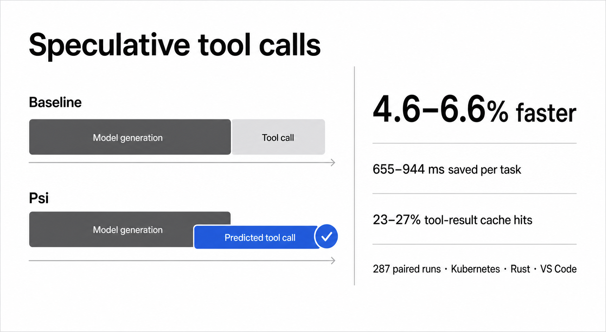

# Psi

## Overview

Psi is a small terminal coding agent written in Rust. I built it partly to
understand the pieces of an agentic loop from the ground up, and partly to
explore whether predicting tool calls can hide some of the time agents spend
waiting on tools.

The agent has a terminal UI and a minimal set of tools inspired by
[Pi](https://github.com/earendil-works/pi). Its benchmark harness can record and
replay real agent runs, then compare two ways of predicting the model's next
tool call. Direct prediction asks a smaller model for its best guess, while
branch sampling generates several possible continuations and uses the tool
calls they suggest.

Psi assumes a trusted workspace and does not provide an OS sandbox. Use a
container or another sandbox when working with untrusted code.

## Getting started

You will need Rust 1.88 or newer and an OpenAI API key. From the repository
root, set the key and build the workspace:

```sh
export OPENAI_API_KEY="..."
cargo build --workspace
```

Run `psi` without a prompt to open the terminal UI:

```sh
cargo run -p psi
```

Pass a prompt to run a single turn without opening the UI, or use `--continue`
to resume the most recent session:

```sh
cargo run -p psi -- "Summarize this codebase"
cargo run -p psi -- --continue
```

Run the full test suite with:

```sh
cargo test --workspace
```

Run a baseline benchmark:

```sh
cargo run -p psi-core --bin psi-bench -- --trials 5
```

Compare direct prediction and branch sampling against a local vLLM endpoint:

```sh
cargo run -p psi-core --bin psi-bench -- \
  --predictor-url http://localhost:8000/v1 \
  --predictor-model MODEL \
  --predictor-chat \
  --strategy direct \
  --strategy branch \
  --prediction-budget 256 \
  --execution-budget 2 \
  --samples 4
```

Optional environment variables are `PSI_MODEL`, `PSI_BASE_URL`, and
`PSI_SESSIONS_DIR`. Run `cargo run -p psi -- --help` or
`cargo run -p psi-core --bin psi-bench -- --help` for the full command help.

## Experiment



To measure Psi, I recorded GPT-5.6 Luna/max completing 18 code-navigation tasks:
six each in the Kubernetes, Rust, and VS Code repositories. I replayed those
runs with and without speculative tool calls, keeping the model responses and
tool delays the same. The predictor models ran through vLLM on rented RunPod
H100s, while Psi and the repository tools ran locally. I tested each setup twice
and completed 287 comparisons.

| Predictor | Strategy | Prefix caching | Time saved per task | Speedup |
| --- | --- | ---: | ---: | ---: |
| Qwen3.5-4B | Direct | Off | 655 ms | 4.63% |
| Qwen3.5-4B | Branch | Off | 736 ms | 5.20% |
| Qwen3.5-4B | Direct | On | 726 ms | 5.14% |
| Qwen3.5-4B | Branch | On | 750 ms | 5.31% |
| Qwen3.5-35B-A3B-FP8 | Direct | Off | 881 ms | 6.23% |
| Qwen3.5-35B-A3B-FP8 | Branch | Off | 811 ms | 5.73% |
| Qwen3.5-35B-A3B-FP8 | Direct | On | 755 ms | 5.23% |
| Qwen3.5-35B-A3B-FP8 | Branch | On | 944 ms | 6.57% |

All eight setups were faster than running without speculation and produced the
same results. Psi reused a predicted tool result on 23–27% of calls, mostly
repository searches.

Psi only starts three read-only tools early: `search`, `read_file`, and
`list_directory`. Writes stay under the main model's control. This limited tool
set may be easier to predict than open-ended coding work. Prefix caching speeds
up repeated predictor prompts; Psi separately caches predicted tool results for
the current turn.
